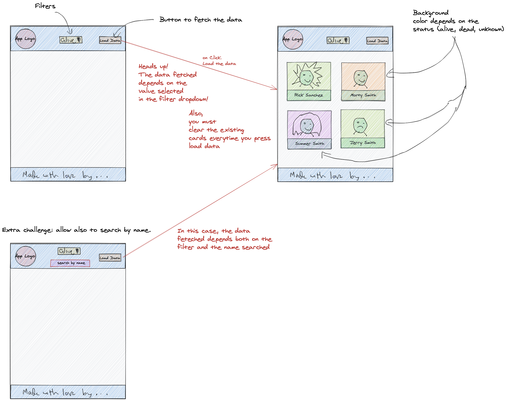
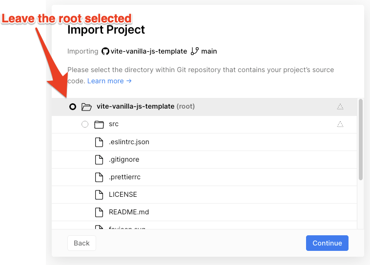
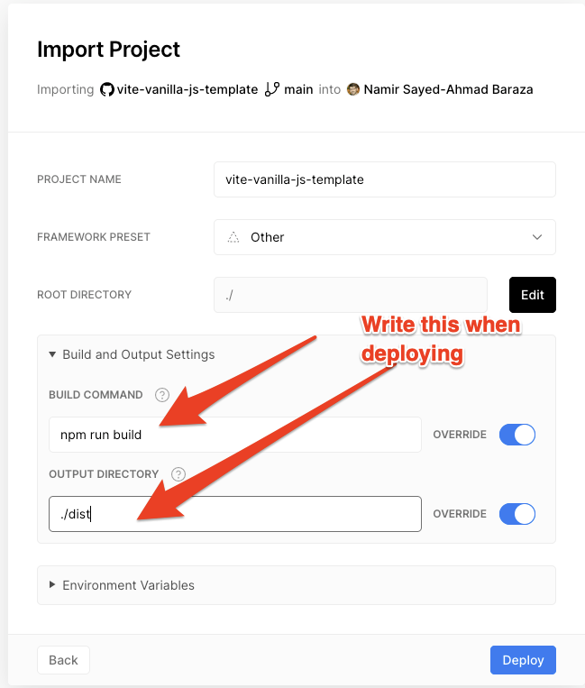

# Rick and Morty Exercise

Use the [Rick and Morty API](https://rickandmortyapi.com/) to fetch data and render it to your app.

To start use [this template](https://github.com/mpagels/vite-vanilla-js-template) and follow the steps in the readme

`Deploy` your app to vercel so you can send it to your family & friends.

Make the app `responsive` (mobile first / then desktop)

## Exercise #1

Build a button and when you click the button fetch data from `https://rickandmortyapi.com/api/character` and render all the names and the picture of the characters you are getting back to your app.

## Exercise #2

Create the possibility to let the user set a filter, if he wants to display only characters that are `alive`, `dead` or `unknown`.

Then click the button and the app should only renders the characters depending on the option that was set.

## Exercise #3

Add another `filter` option, like an `input` where the user can input a name. And the api should return the character depending on the filters, that are set. ( `character name` & `alive | dead | unkown`)

## Design Layout Orientation

This is just a quick scribble for your orientation.
There is a header which contains a `App-logo`, the fetch `button`, and the filter `dropdown`.
The footer contains just a lovely text.
The main contains the `cards` with the content from the api.

## Help

In this exercises you will learn to read something, someone wrote for you, to try to explain how to use his or her code (or app).

Read the api documentation really well. It is everything in there.

Remember. You just getting data. What you are doing with it, is up to you!

Have fun.

### Tips

Make a lot of pull requests. (per feature or exercise)
Try to help each other. (Exchange reviews. Like: If I make a review for your PR you can make one for me)
Remember: Reviewing other Pull Requests is contributing to your github profile. And you will learn a lot by reading others code.

### Vercel Deployment

### Resources

- [Rick and Morty API](https://rickandmortyapi.com/)
- [Rick and Morty Characters Documentation](https://rickandmortyapi.com/documentation/#character)
- [Rick and Morty Characters API Endpoint](https://rickandmortyapi.com/api/character/)
- [Codepen.io Promises Syntax](https://codepen.io/neuefische/pen/YzNyRWG?editors=0011)

- [Namirs fetch-example](https://github.com/namirsab/fetch-example)
